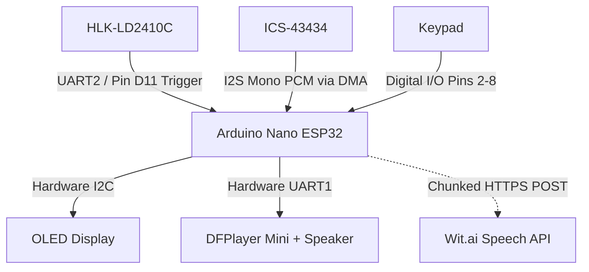
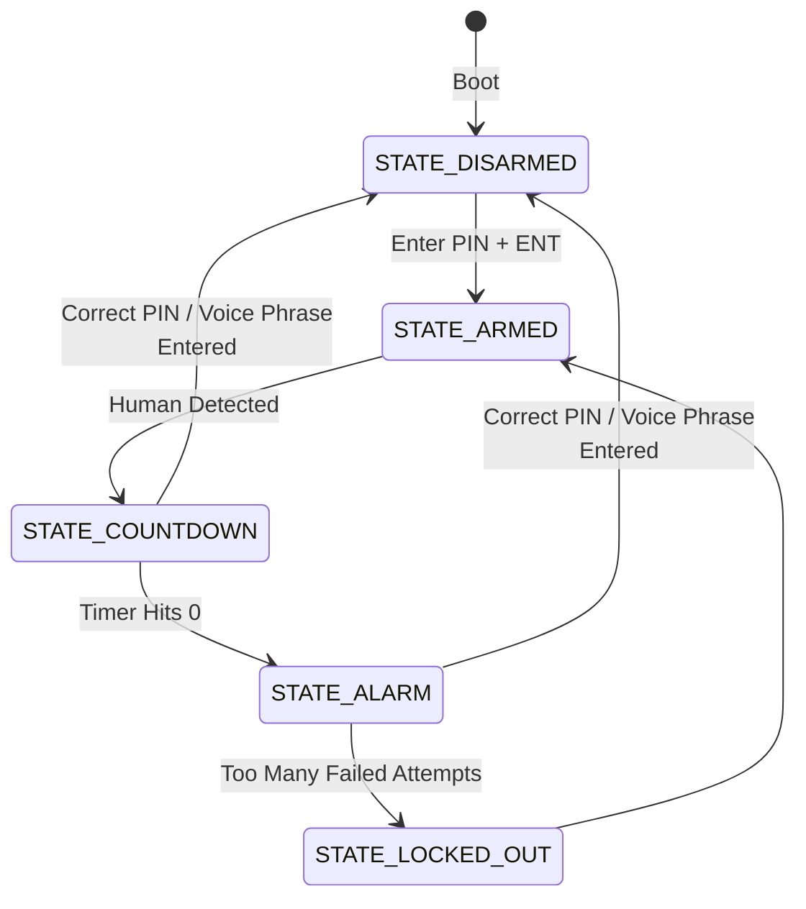

# H.S.O.D. : Home Security Of DOOM

A simple home security alarm with personality and a little twist ***wink*** ***wink***.


## What is it?

It is just like your simple, ordinary home security/alarm system. If you input your PIN to arm or disarm the alarm, and if you proceed to enter your PIN just in time, the alarm won't go off. However, when H.S.O.D went off... It doesn't just play a normal alarm... I will scare the burglar away (hopefully)... it plays a pre-recorded audio which you can customize/add custom audio to your liking, of how you would like to torment your burglar.

My personal option is DOOM ETERNAL MUSIC INTRO with + "so you are the chosen one."


## How do you use it?

It is very simple, here's how to use it!

### 1. Arming the Device
* **Action:** On boot, the system is disarmed. Input the PIN.
* **Outcome:** The current state of the device will change from unarmed to armed, and the OLED display and an audio cue from the speaker will indicate that!

### 2. INTRUDER ALERT!!!
* **Action:** Human detected.
* **Outcome:** The device enters a warning state or a countdown state, to be exact. The OLED display and a countdown coming from the speaker tracking your remaining time will also indicate that!

### 3. Disarming the Device
* **Action:** Input the PIN.
* **Outcome:**
  * **Correct PIN:** Everything resets and goes back to normal (back to the unarmed/disarmed state), the OLED display and the sound cue will also indicate it as well!
  * **Incorrect PIN:** Everything continues, but you can still go ahead and try again until the countdown reaches zero (but there's also a max attempt)


## System Architecture




## State Machine




## Why did I make it?

Here's a little back story. I passed an entrance exam to one of the best high schools in Thailand (Triam Udom Suksa School, btw ***wink*** ***wink***), which means I have to move away and live alone in the big city, but, being a country boy, I came up with an idea. Wouldn't it be so fitting to add some security measures to my apartment because I'm living alone? Normal Securities are boring, corporate, no personality, there's nothing interesting, so I came up with something new of my own! I came up with this!


## Step-By-Step Build Guide.

### Tools You Will Need
* **Soldering Iron & Solder Wire** 
* **Wire Flush Cutters** (to snip long component legs)
* **Tweezers** (super helpful for holding tiny parts)
* **Multimeter** (for checking your connections later)


---

### [1] : Prep Your MicroSD Card

1. Plug your **MicroSD card** into your computer and format it to **FAT32**.
2. Create a folder right on the root directory named exactly `mp3`.
3. Drop your custom audio files inside (`0001.mp3`, `0002.mp3`, etc.)
   
   *  `0001.mp3` = Warning beep
   *  `0002.mp3` = Full alarm audio
   *  `0003.mp3` = Armed sound
   *  `0004.mp3` = Disarmed sound
   *  `0005.mp3` = Incorrect sound
   *  `0006.mp3` = Locked out sound
   *  `0007.mp3` = Startup sound

4. Eject the card and insert it right into the slot of the **DFPlayer Mini (U3)**.


### [2] : Surface Mount (SMD) Components First

1. **Solder the SMD Resistors:** Locate the pads for the two **220Ω resistors (R1, R3)** and the **1kΩ resistor (R2)**.
2. **Solder the SMD LEDs:** Locate the pads for the **Red LED (D1)** and **Green LED (D14)**. 
   * ⚠️ **IMPORTANT NOTE:** LEDs only work in one direction. Look at the bottom or the edge of the tiny SMD LED. There will be a green line, a "T" shape, or a dot. This marks the negative side (Cathode). Match this to the silkscreen markings on the board before soldering.


### [3] : Through-Hole (THT) Diodes

1. **Bend the Matrix Diodes:** Take the 12 **1N4148 diodes (D2 to D13)** and bend their wire legs at 90 degrees so they look like staples.
2. **Match the Stripe:** Push them into the board slots near the key switches. The **black stripe** on the glass diode body must match up perfectly with the thick white line printed on the board's silkscreen.
3. **Solder and Snip:** Flip the board over, solder the legs down, and use your flush cutters to snip off the leftover wires.


### [4] : The Keypad Switches

1. **Snap Them In:** Push the 12 **Cherry MX Mechanical Switches (SW1 to SW12)** into the big key grid squares on the board. 
2. **Solder the Matrix:** Flip the board over and solder both pins on all 12 switches so they sit perfectly flat.


### [5] : Modules

The PCB has dedicated pin-hole matching slots for all the main modules. No crazy wiring setups needed, just drop them right into their designated places. Simple, ain't it?

1. **Solder the Main Microcontrollers:** Drop the **Arduino Nano ESP32 (A1)** and the **DFPlayer Mini (U3)** straight into their pin slots on the PCB. Flip the board and solder all the pins from the back. Make sure the USB-C port on the Arduino points outward toward the edge of the board.
2. **Solder the Screen & Sensors:** Line up the pins for your **0.96" OLED Display (U1)**, the **HLK-LD2410C Radar (U2)**, and the **ICS-43434 Microphone (MK2)**. Drop them into their spots on the PCB and solder them down securely.
3. **Attach the Speaker:** Solder the two wires from the **8Ω 1W Speaker (LS1) or the CMS-18138A-SP** directly to the marked `SPK_1` and `SPK_2` pads right next to the DFPlayer Mini section.

### [6] : Uploading Firmware (PlatformIO)

This project is built using **PlatformIO** which is inside of VS Code instead of the standard Arduino IDE. Here is how to flash the firmware:

#### 1. Clone the Project
Open your computer's terminal or command prompt, navigate to where you want to save the project, and clone this repository:
```bash
git clone https://github.com/NattDocumented/HSOD-Home-Security-Of-DOOM.git
```

#### 2. Open in VS Code
1. Launch **Visual Studio Code**.
2. Make sure you have the official **PlatformIO IDE** extension installed (look for the alien icon on the left sidebar).
3. Click `File` > `Open Folder...` from the top menu, navigate to the folder you just cloned, and click **Open**. (Make sure you open the root folder containing the `platformio.ini` file)

#### 3. Making Voice Unlock Works

1. Login to [Wit.ai](https://wit.ai) with your Meta (a.k.a. Facebook) account.
2. If done correctly, it should lead you to the dashboard/apps, if not [click this](https://wit.ai/apps).
3. Click **+ New App** to create a new app **(obviously)**. You can name it whatever you please, but I personally just named it `"hsod"`.
4. Go into your newly created app. You'll see a sidebar. Click on **Management**, and go to **Settings**.
5. Copy your **Client Access Token** and replace these line in the firmware's code.
   
    ```cpp
    const char* WIFI_SSID = "YOUR_WIFI_SSID"; // Your WiFi's SSID
    const char* WIFI_PASS = "YOUR_WIFI_PASSWORD"; // Your WiFi Password here
    const char* WIT_TOKEN = "YOUR_WIT_AI_TOKEN"; // Your Wit.ai's token here
    ```

6. **Done!** This part is finish. Let's move on to the next one.

#### 4. Build and Upload
1. Connect a USB-C data cable from your computer into your Arduino Nano ESP32 port.
2. Click the **PlatformIO Alien Icon** on the left menu bar.
3. Under the Project Tasks menu, click **Build** to compile the codebase.
4. Once the terminal displays a green `[SUCCESS]` message, click **Upload** right below it to flash the firmware onto your board.

#### 5. Done
As soon as the upload completes, the Green SMD LED will light up, the OLED screen will wake up showing the main menu, and your speaker will play the system startup sound.

### [7] : Casing / Enclosure

After finishing the other steps, I think this one is the easiest, so don't be tired yet, lmao.

1. **Have your 3D printed casing / Enclosure ready:** if you haven't done that, go ahead and print it, no rush, because I'm not going anywhere lmao.
2. **Assemble:** This is easy. There should be 2 parts: the base and the lid. Since there are poles on the base and holes on the PCB for assembly, simply insert the PCB into the enclosure while making sure the USB of the Arduino Nano ESP32 is right where the hole for the USB on the casing is. After, just put the base and lids together while making sure all the components that should be visible are visible. Both the base and the lid have sockets for connecting to each other.
3. **Done!**

You can now enjoy this amazing device. Hope you have a great experience. Any feedback is appreciated.

## Gallery

### Schematics


### PCBs


### Casing / Enclosure Design


