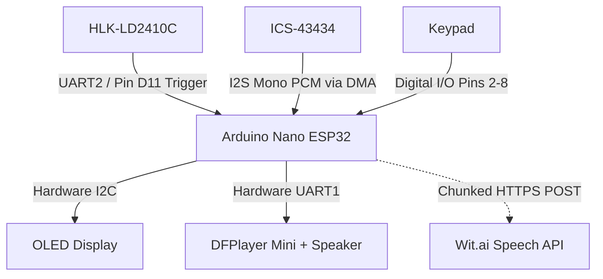
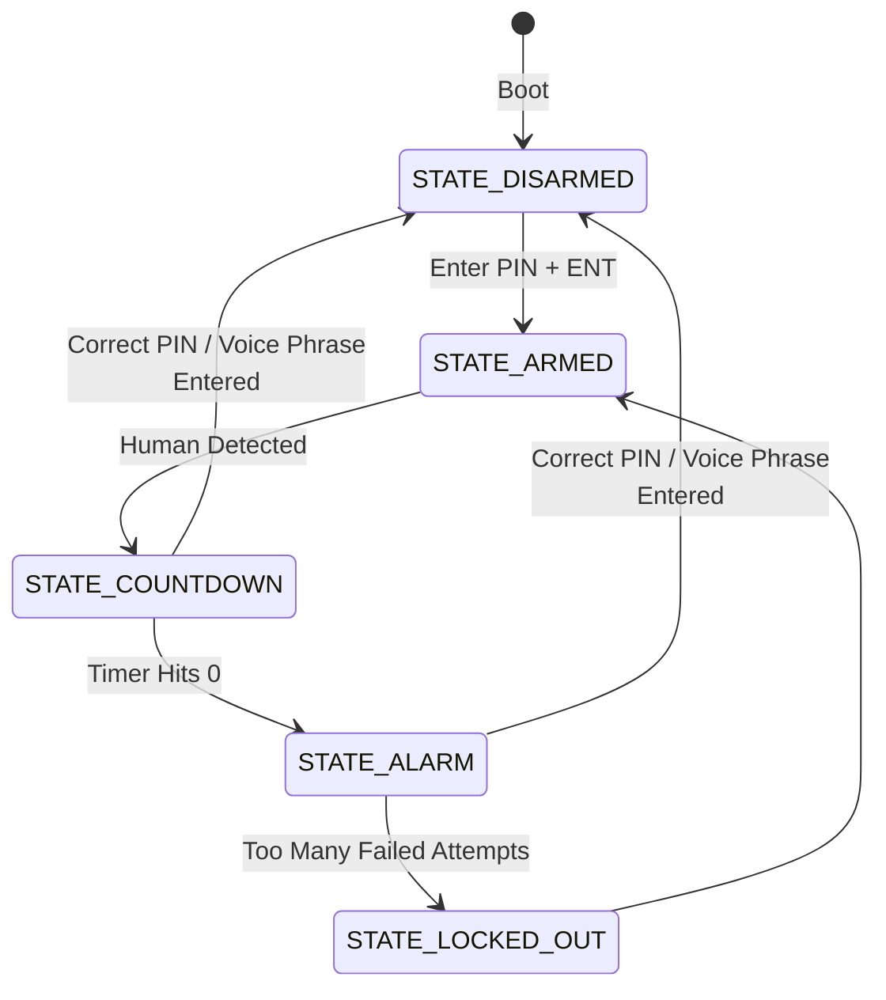
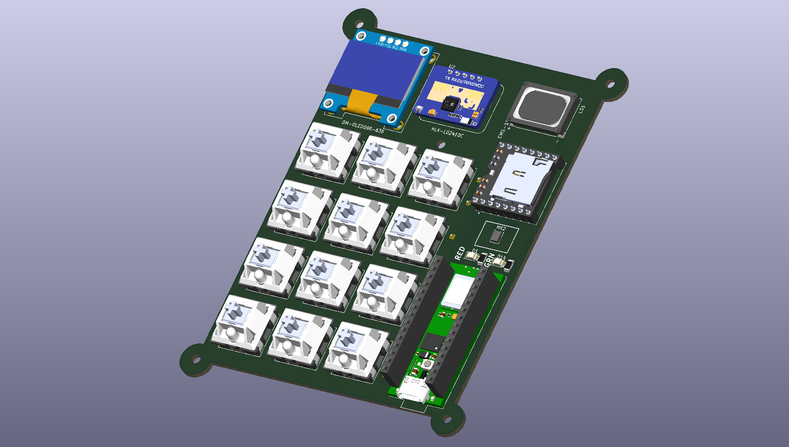
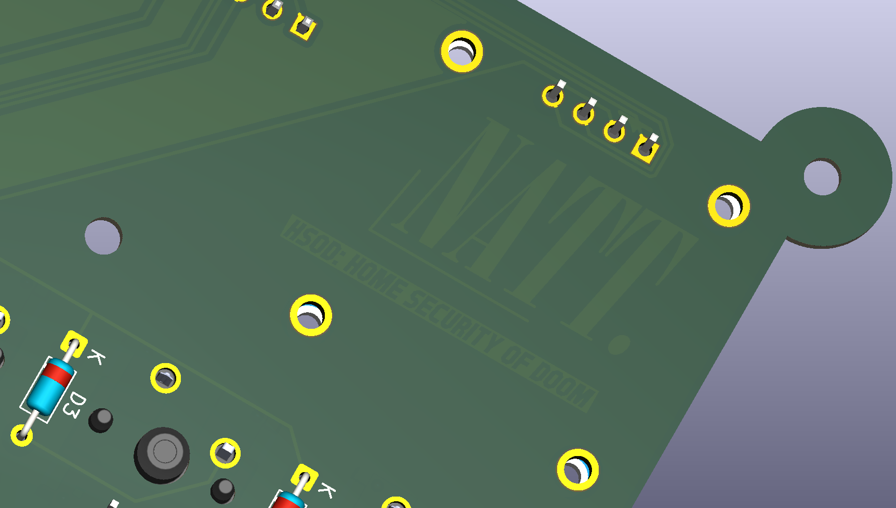
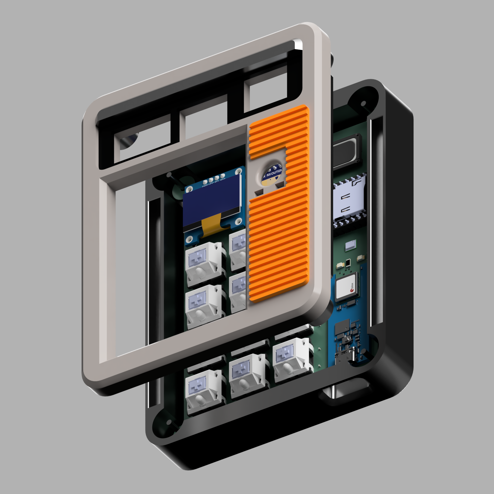
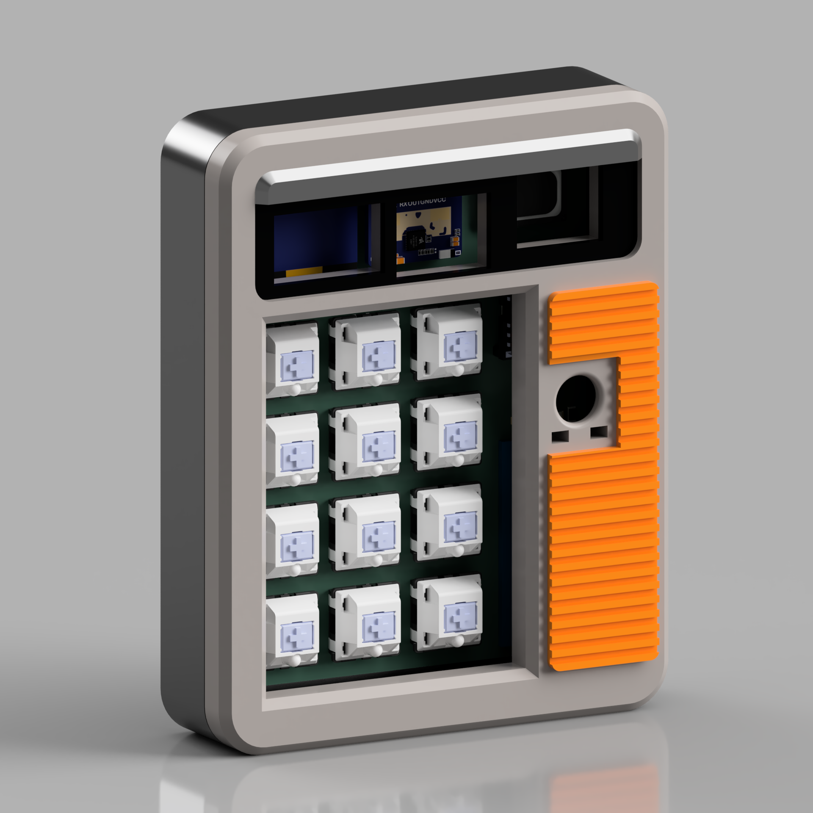
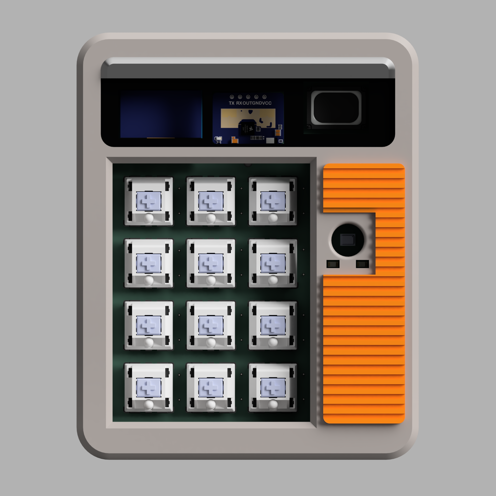

# H.S.O.D. : Home Security Of DOOM

A simple home security alarm with personality and a little twist ***wink*** ***wink***.

## What is it?

It is just like your simple, ordinary home security/alarm system. If you input your PIN to arm or disarm the alarm, and if you proceed to enter your PIN just in time, the alarm won't go off. However, when H.S.O.D went off... It doesn't just play a normal alarm... I will scare the burglar away (hopefully)... it plays a pre-recorded audio which you can customize/add custom audio to your liking, of how you would like to torment your burglar.

My personal option is DOOM ETERNAL MUSIC INTRO with + "so you are the chosen one."

## How do you use it?

It is very simple, here's how to use it!

### 1. Arming the Device
* **Action:** On boot, the system is disarmed. Input the PIN.
* **Outcome:** The current state of the device will change from unarmed to armed, and the OLED display and an audio cue from the speaker will indicate that!

### 2. INTRUDER ALERT!!!
* **Action:** Human detected.
* **Outcome:** The device enters a warning state or a countdown state, to be exact. The OLED display and a countdown coming from the speaker tracking your remaining time will also indicate that!

### 3. Disarming the Device
* **Action:** Input the PIN.
* **Outcome:**
  * **Correct PIN:** Everything resets and goes back to normal (back to the unarmed/disarmed state), the OLED display and the sound cue will also indicate it as well!
  * **Incorrect PIN:** Everything continues, but you can still go ahead and try again until the countdown reaches zero (but there's also a max attempt)

## System Architecture

## State Machine

## Why did I make it?

Here's a little back story. I passed an entrance exam to one of the best high schools in Thailand (Triam Udom Suksa School, btw ***wink*** ***wink***), which means I have to move away and live alone in the big city, but, being a country boy, I came up with an idea. Wouldn't it be so fitting to add some security measures to my apartment because I'm living alone? Normal Securities are boring, corporate, no personality, there's nothing interesting, so I came up with something new of my own! I came up with this!

## Gallery

### Schematics

### PCBs

### Casing / Enclosure Design

